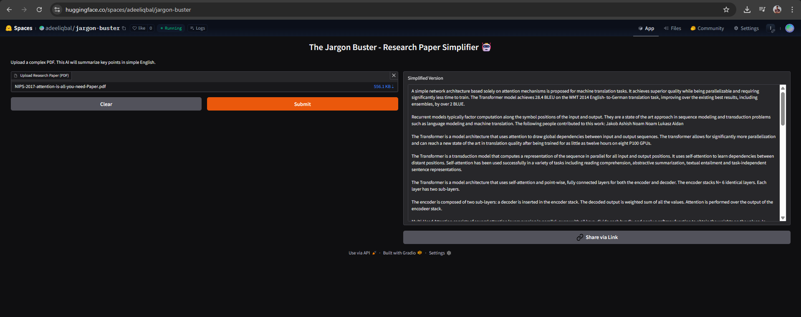

# Research Paper Simplifier - Transformer 🤖

[](https://huggingface.co/spaces/YOUR_USERNAME/Jargon-Buster-Bot)
[](https://www.python.org/)
[](https://huggingface.co/google/flan-t5-large)

An AI-powered NLP tool that simplifies complex academic research papers into plain, easy-to-understand English. Built using Google's **FLAN-T5 Large** Transformer model and **Gradio** for the user interface.

---

## 🚀 Live Demo

Try the application live on **Hugging Face Spaces**:

🔗‍️ **[The Jargon Buster](https://huggingface.co/spaces/adeeliqbal/jargon-buster)**

*(https://huggingface.co/spaces/adeeliqbal/jargon-buster)*

---

## 📸 App Preview



---

## 💡 Key Features

* **PDF Parsing:** Upload any research paper (PDF format) directly.
* **Intelligent Chunking:** Automatically splits long documents into manageable sections to respect token limits.
* **Seq2Seq Simplification:** Uses a fine-tuned Encoder-Decoder Transformer to rewrite jargon into "Simple English."
* **Hallucination Control:** Includes custom logic to prevent repetition loops and factual errors.
* **CPU Optimized:** Optimized to run efficiently on free-tier cloud environments (Hugging Face Spaces).

---

## 🛠️ Tech Stack

* **Language:** Python 3.10
* **Model:** `google/flan-t5-large` (780M parameters)
* **Libraries:** `transformers`, `torch`, `gradio`, `PyPDF2`
* **Architecture:** Sequence-to-Sequence (Seq2Seq) Transformer

---

## 📂 Project Structure

```bash
research-paper-simplifier-transformer/
│
├── app.py                                  # The main application script (Deployment ready)
├── research_paper_simplifier_transformer.ipynb # Original Colab development notebook
├── requirements.txt                        # Dependencies list
├── README.md                               # Project documentation
│
├── Paper/                                  # Sample research papers for testing
│   └── attention_is_all_you_need.pdf
│
└── Screenshot/                             # Images for README
    └── preview1.png
```

---

## ⚙️ Installation & Usage

You can run this project locally on your machine.

### 1. Clone the Repository

```bash
git clone https://github.com/adeel-iqbal/research-paper-simplifier-transformer.git
cd research-paper-simplifier-transformer
```

### 2. Install Dependencies

```bash
pip install -r requirements.txt
```

### 3. Run the App

```bash
python app.py
```

The app will launch in your browser at `http://127.0.0.1:7860`.

---

## 🧠 How It Works

1. **Extraction:** The app uses `PyPDF2` to extract raw text string from the uploaded PDF.
2. **Chunking:** The text is split into chunks of ~1500 characters. This is crucial because Transformers have a "Context Window" limit (usually 512-1024 tokens).
3. **Inference:** Each chunk is fed into the FLAN-T5 model with a specific prompt: "Summarize the key points of this text in clear, simple English."
4. **Reconstruction:** The simplified chunks are joined together to form the final summary.

---

## 📋 Requirements

Create a `requirements.txt` file with the following dependencies:

```
transformers>=4.30.0
torch>=2.0.0
gradio>=3.35.0
PyPDF2>=3.0.0
```

---

## 🚀 Deployment on Hugging Face Spaces

1. Create a new Space on [Hugging Face](https://huggingface.co/spaces)
2. Choose "Gradio" as the SDK
3. Upload your `app.py` and `requirements.txt`
4. The app will automatically build and deploy

---

## 🤝 Contributing

Contributions, issues, and feature requests are welcome! Feel free to check the [issues page](https://github.com/adeel-iqbal/research-paper-simplifier-transformer/issues).

---

## 📬 Contact

**Adeel Iqbal Memon**

* 📧 Email: adeelmemon096@yahoo.com
* 🔗 LinkedIn: [adeeliqbalmemon](https://linkedin.com/in/adeeliqbalmemon)
* 🐙 GitHub: [adeel-iqbal](https://github.com/adeel-iqbal)

---

## ⭐ Show Your Support

Give a ⭐️ if this project helped you!

---

## 🙏 Acknowledgments

* Google Research for the FLAN-T5 model
* Hugging Face for the Transformers library and hosting platform
* The open-source community for inspiration and support
